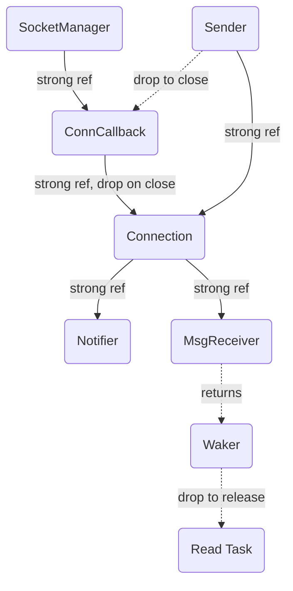

# A C++ Library Developed In Rust Tokio To Manage Multiple TCP Connections

Easily manage multiple socket connections asynchronously in C++. 

## Installation

- Step 1: Install Rust Nightly

```shell
curl https://sh.rustup.rs -sSf | sh -s -- -y --default-toolchain nightly
```

- Step 2: Install LLVM 16

macOS:
```shell
brew install llvm@16
# get brew environment
eval "$(brew shellenv)"
```

linux
```shell
wget https://apt.llvm.org/llvm.sh
chmod +x llvm.sh
sudo ./llvm.sh 16 all
sudo ./update-alternatives-clang.sh 16 9999
```

- Step 3: Pull the source code

```shell
git clone https://github.com/Congyuwang/socket_manager.git
cd socket_manager
git submodule update --init
```

- Step 4: Build and Install

As a shared library:

```shell
cmake -B build -DCMAKE_BUILD_TYPE=Release \
               -DCMAKE_TOOLCHAIN_FILE=toolchain.cmake \
               -DCMAKE_INTERPROCEDURAL_OPTIMIZATION=ON
cmake --build build --parallel 4 --config Release
sudo cmake --install build --config Release
```

As a static library:
```shell
cmake -B build -DCMAKE_BUILD_TYPE=Release \
               -DCMAKE_TOOLCHAIN_FILE=toolchain.cmake \
               -DCMAKE_INTERPROCEDURAL_OPTIMIZATION=ON \
               -DBUILD_SHARED_LIBS=OFF
cmake --build build --parallel 4 --config Release
sudo cmake --install build --config Release
```

## Usage

In your CMakeLists.txt, add the following lines:
```cmake
find_package(socket_manager 0.2.0 REQUIRED)
target_link_libraries(test_socket_manager PUBLIC socket_manager)
```

### Linking as Static Library
For linking, add the lines in the `toolchain.cmake` in your toolchain file
or use the provided `toolchain.cmake` to ensure the right toolchain is used.

Example:
```cmake
set(CMAKE_TOOLCHAIN_FILE ${CMAKE_SOURCE_DIR}/toolchain.cmake)
```

To enable lto, add:
```cmake
set_property(TARGET <your-target> PROPERTY INTERPROCEDURAL_OPTIMIZATION TRUE)
```

## Memory (resource) Model

Dropping `Sender` will close the connection, and drop its
reference to `Connection`.
`ConnCallback` will drop its internal reference to `Connection` when
the connection is closed.
Thus `Connection` will free any reference to `Notifier`
or `MsgReceiver`.
Note to drop all related resources, no reference to the
returned `Waker` should be kept.



See the example folder for more complicated case.
