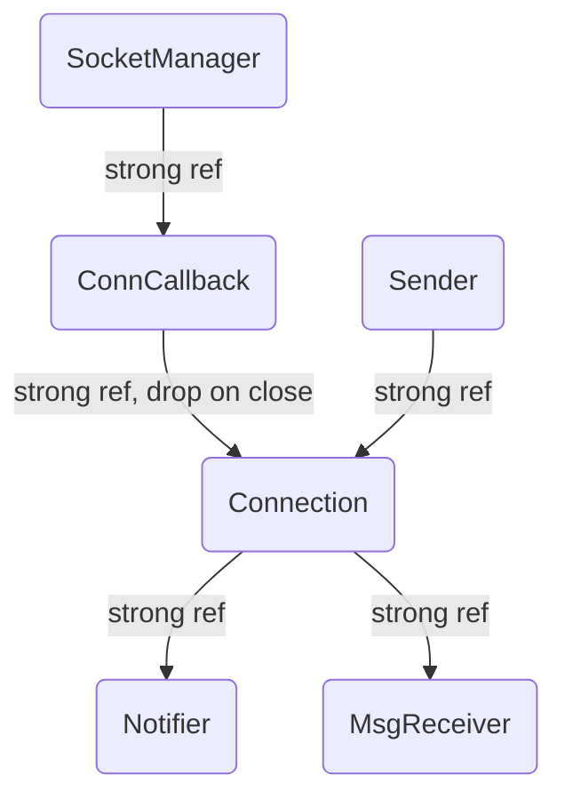
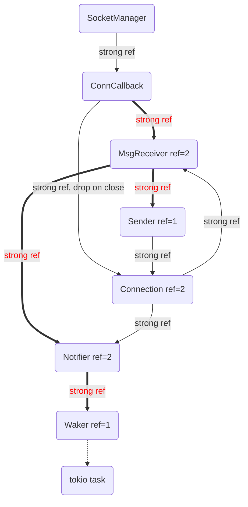
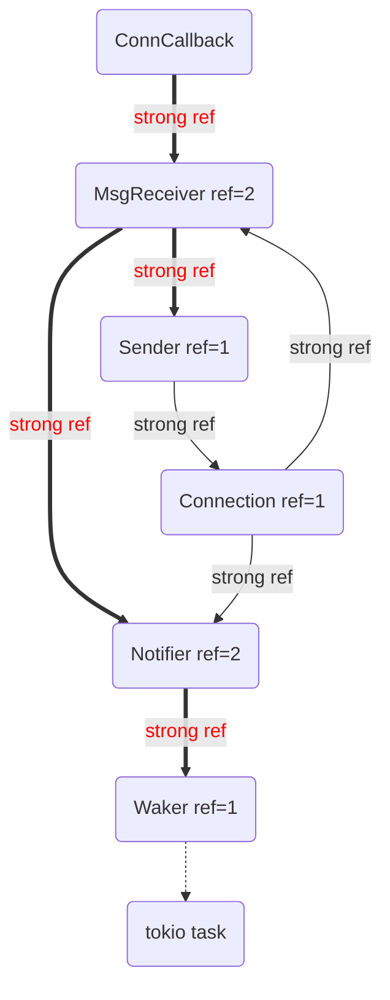
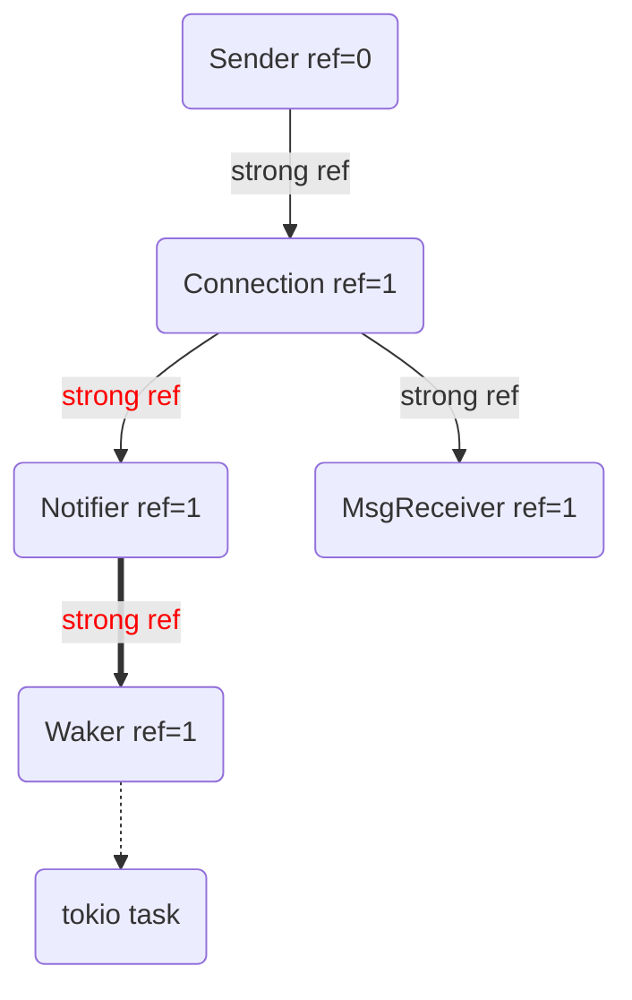

# An Echo Server Implemented Using SocketManager

Implementing Echo using SocketManager is a bit tricky to
make the memory model correct.

## The Memory Model Before Echo
Dropping `Sender` will close the `Write` side of the socket connection,
and drop its reference to `Connection`.
`ConnCallback` will drop its internal reference to `Connection` when
the connection is closed.
Thus `Connection` will free any reference to `Notifier`
or `MsgReceiver`.
Note to drop all related resources, no reference to the
returned `Waker` should be kept.

## The Memory Model Of Echo

`Sender` is now referenced by `MsgReceiver` for sending
back the message, and cannot be dropped easily,
thus a cycle of reference is created.

New links are marked in red.

The echo connection can be closed only be the remote,
thus we receive a `on_close` event from `ConnCallback`,
which will drop its reference to `Connection`.
Creating the following:

Now, using the reference of `MsgReceiver` in `ConnCallback`,
we manually call erase the reference to `Sender` and `Notifer`
in `MsgReceiver`, and then drop the reference of `MsgReceiver`:

Now everything will be cleared up.
